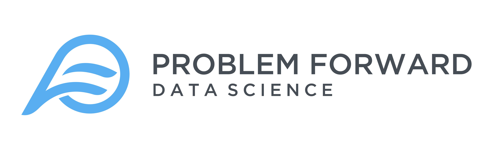

 

# Problem Forward Project Template
Standard Problem Forward project format / branding

## To install:

Run:

> `devtools::install_github("problemforward/PFbaseproject", auth_token = "YOUR TOKEN")`

with your Personal Access Token (PAT) passed to the `auth_token` argument.

Below here is a generic README.md template as a guide to our clients who may view our GitHub repos.

## Generic README.md stuff below:

## Overview 
This is a README for the _____ that is a collaboration between Problem Forward and ____. This is an overview of the project and will contain iterative updates so we can follow what is happening in the file.

### Project Structure
This project has three main subfolders.
  
* *code* is where all of our code goes. This folder has two types of code in it:
    + *final_code*, which is code that is used in final projects transferred to clients, and 
    + *raw_code*, which consists of code used for exploration but not used in any final project.
* *data* is for storage of data pertaining to the project. This and its subfolders will not be accessible via GitHub, but may be produced by code in the code folder. This folder has two types of data in it:
    + *raw_data*, which generally consists of files received from the client that haven't been processed yet.
    + *tidy_data*, which consists of data that are organized and ready for analysis, and
* *products* has individual deliverables, such as presentations, figures, or apps that can be transferred to clients. This folder includes one sample report formatted to ProblemForward standards. Depending on the project and our client's needs, useful subfolders may within *products* could include:
    + *reports*, for documents and the like,
    + *figures*, for plots, images, and other graphics, or 
    + *rsconnect* which is required for Shiny apps.

## Branding
Whenever you can, include [links](www.problemforward.com) to our website.

## Contact
Please feel free to edit this template with improvements!

And you can always reach out to [Kenny](mailto:kmorales@problemforward.com) if you need to.
